# We-Warehouse - สถาปัตยกรรมระบบและ Flow การทำงาน

> **วัตถุประสงค์หลัก:** ระบบจัดการคลังสินค้า (WMS) ของ JLC Group ที่ครอบคลุมตั้งแต่การรับสินค้า จัดเก็บ หยิบ แพค จัดส่ง และติดตามเงิน

---

## 🏗️ ภาพรวมสถาปัตยกรรม

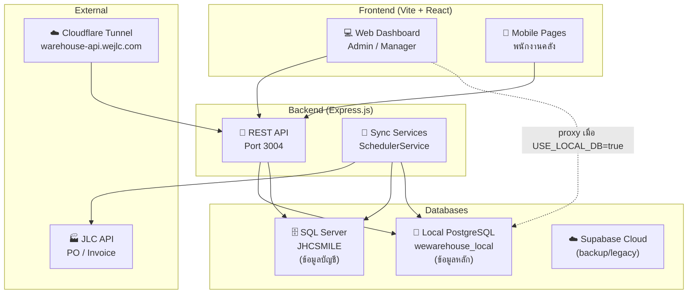

---

## 📦 Flow 1: การรับสินค้าเข้าคลัง (Inbound)

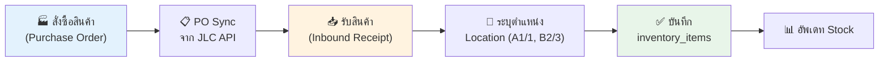

### ไฟล์ที่เกี่ยวข้อง:

| Layer | ไฟล์ | หน้าที่ |
|-------|------|---------|
| **Page** | `MobileReceive.tsx` | หน้าจอรับสินค้า (มือถือ) |
| **Component** | `InboundReceiptModal.tsx` | Modal กรอกข้อมูลรับ |
| **Hook** | `useInboundReceipts.ts` | จัดการ state รับสินค้า |
| **Service** | `inboundReceiptService.ts` | Logic การรับ + บันทึก inventory |
| **Service** | `purchaseOrderService.ts` | จัดการ PO |
| **Backend** | `poSyncService.ts` | Sync PO จาก JLC API |
| **DB Table** | `purchase_orders`, `inbound_receipts`, `inventory_items` | ข้อมูล |

---

## 📍 Flow 2: จัดเก็บและจัดการตำแหน่ง (Location Management)

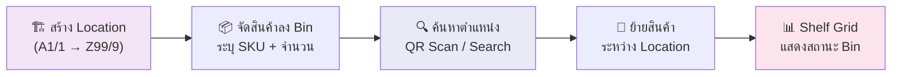

### ไฟล์ที่เกี่ยวข้อง:

| Layer | ไฟล์ | หน้าที่ |
|-------|------|---------|
| **Page** | `LocationDetail.tsx` | รายละเอียดตำแหน่ง |
| **Page** | `LocationLookup.tsx` (mobile) | ค้นหาตำแหน่ง |
| **Component** | `ShelfGrid.tsx` | แผนผัง Shelf แบบ Grid |
| **Component** | `LocationQRModal.tsx` | QR Code ของตำแหน่ง |
| **Component** | `ItemMove.tsx` (mobile) | ย้ายสินค้าระหว่าง Bin |
| **Service** | `locationActivityService.ts` | บันทึกกิจกรรมตำแหน่ง |
| **Service** | `locationQRService.ts` | สร้าง/อ่าน QR |
| **DB Table** | `warehouse_locations`, `inventory_items` | ข้อมูล |

---

## 🛒 Flow 3: ขาย & ออเดอร์ (Sales & Orders)

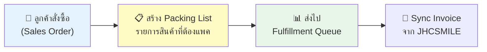

### ไฟล์ที่เกี่ยวข้อง:

| Layer | ไฟล์ | หน้าที่ |
|-------|------|---------|
| **Component** | `SalesTab.tsx` | แท็บยอดขาย |
| **Component** | `OrdersTab.tsx` | แท็บออเดอร์ |
| **Component** | `PackingListTab.tsx` | Packing List |
| **Component** | `SalesOrderModal.tsx` | สร้าง/แก้ไขออเดอร์ |
| **Hook** | `useSalesOrders.ts` | จัดการ state ออเดอร์ |
| **Service** | `salesBillService.ts` | ดึง/จัดการบิลขาย |
| **Service** | `salesOrderService.ts` | Logic ออเดอร์ |
| **Backend** | `salesRoutes.ts` | API ยอดขาย |
| **Backend** | `shipmentSyncService.ts` | Sync invoice จาก JHCSMILE |
| **DB Table** | `customer_orders`, `order_items`, `shipment_orders` | ข้อมูล |

---

## 📋 Flow 4: กระจายงาน → หยิบ → แพค → ส่ง (Pick/Pack/Ship)

> **นี่คือ Flow หลักของระบบคลัง**

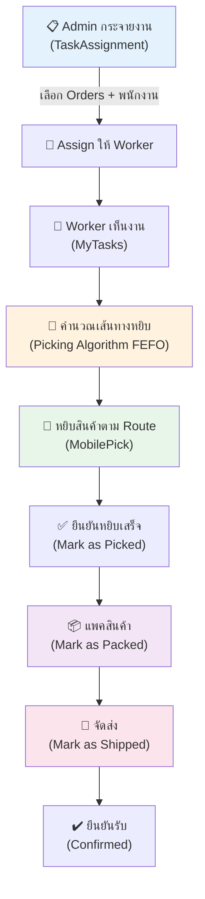

### สถานะของ Order:

```
pending → assigned → picking → picked → packed → shipped → confirmed
```

### ไฟล์ที่เกี่ยวข้อง:

| Layer | ไฟล์ | หน้าที่ |
|-------|------|---------|
| **Page** | `TaskAssignment.tsx` | Admin กระจายงาน |
| **Page** | `MyTasks.tsx` (mobile) | งานของ Worker |
| **Page** | `MobilePick.tsx` (mobile) | หน้าหยิบสินค้า |
| **Page** | `LocationTasks.tsx` (mobile) | งานตามตำแหน่ง |
| **Component** | `WarehousePickingSystem.tsx` | ระบบ Picking |
| **Component** | `FulfillmentQueue.tsx` | คิวจัดส่ง |
| **Algorithm** | `pickingAlgorithm.ts` | คำนวณ Picking Plan (FEFO) |
| **Service** | `warehouseAssignmentService.ts` | Assign/Track งาน |
| **Service** | `fulfillmentService.ts` | Logic จัดส่ง |
| **Backend** | `ShipmentService.ts` | CRUD สถานะการส่ง |
| **Backend** | `shipmentRoutes.ts` | API กระจายงาน/สถานะ |
| **DB Table** | `shipment_orders`, `warehouse_assignments` | ข้อมูล |

### Picking Algorithm (FEFO):
```
1. รับรายการสินค้าที่ต้องหยิบ (ProductNeed)
2. ค้นหา inventory ที่มี SKU ตรง
3. เรียงตาม FEFO (First Expired First Out) - MFD เก่าก่อน
4. คำนวณจำนวนที่ต้องหยิบจากแต่ละ Location
5. สร้าง Picking Route เรียงตาม Zone → Position → Level
```

---

## 💰 Flow 5: การเงิน & บัญชี (Finance)

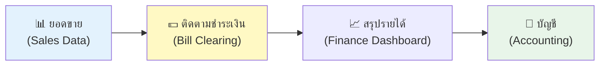

### ไฟล์ที่เกี่ยวข้อง:

| Layer | ไฟล์ | หน้าที่ |
|-------|------|---------|
| **Component** | `FinanceDashboard.tsx` | Dashboard การเงิน |
| **Component** | `AccountingDashboard.tsx` | Dashboard บัญชี |
| **Component** | `BillClearingModal.tsx` | เคลียร์บิล |
| **Hook** | `useBillClearing.ts` | จัดการ state บิล |
| **Hook** | `usePaymentTracking.ts` | ติดตามชำระเงิน |
| **Service** | `accountingService.ts` | Logic บัญชี |
| **Backend** | `csmileService.ts` | ดึงข้อมูลจาก CSMILE |
| **Backend** | `csmileRoutes.ts` | API ข้อมูล CSMILE |

---

## 📊 Flow 6: สินค้า & Stock Overview

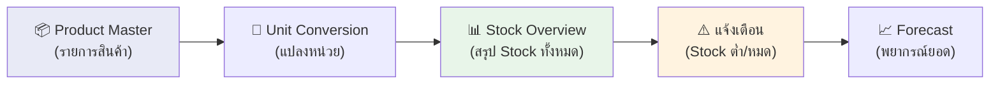

### ไฟล์ที่เกี่ยวข้อง:

| Layer | ไฟล์ | หน้าที่ |
|-------|------|---------|
| **Component** | `ProductGroupOverview.tsx` | ภาพรวมสินค้ากลุ่ม |
| **Component** | `StockSummaryDashboard.tsx` | Dashboard สรุป Stock |
| **Component** | `ProductForecastPrediction.tsx` | พยากรณ์สินค้า |
| **Component** | `UnitConversionSettings.tsx` | ตั้งค่าแปลงหน่วย |
| **Hook** | `useProductsSummary.ts` | สรุปสินค้า |
| **Hook** | `useInventoryAlerts.ts` | แจ้งเตือน Stock |
| **Hook** | `useConversionRates.ts` | อัตราแปลงหน่วย |
| **Service** | `productConversionService.ts` | Logic แปลงหน่วย |
| **DB Table** | `products`, `inventory_items`, `unit_conversions` | ข้อมูล |

---

## 🔄 Flow 7: การย้ายสินค้าระหว่างคลัง (Warehouse Transfer)

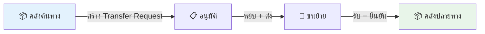

### ไฟล์ที่เกี่ยวข้อง:

| Layer | ไฟล์ | หน้าที่ |
|-------|------|---------|
| **Component** | `WarehouseTransferDashboard.tsx` | Dashboard โอนย้าย |
| **Component** | `InterWarehouseTransferModal.tsx` | Modal โอนระหว่างคลัง |
| **Component** | `BulkTransferModal.tsx` | โอนหลายรายการ |
| **Hook** | `useWarehouseTransfer.ts` | จัดการ state โอน |
| **Service** | `transferService.ts` | Logic การโอน |
| **DB Table** | `warehouse_transfers`, `inventory_movements` | ข้อมูล |

---

## 🏭 Flow 8: Sync ข้อมูลกับระบบภายนอก

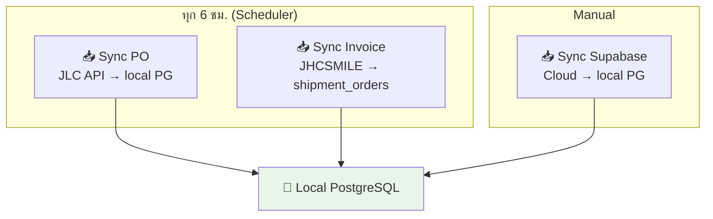

### ไฟล์ที่เกี่ยวข้อง:

| ไฟล์ | หน้าที่ |
|------|---------|
| `schedulerService.ts` | ตั้งเวลา sync ทุก 6 ชม. |
| `poSyncService.ts` | Sync PO จาก JLC API |
| `shipmentSyncService.ts` | Sync invoice จาก JHCSMILE (SQL Server) |
| `sqlServerService.ts` | Query ข้อมูลจาก JHCSMILE |
| `sync_supabase_to_local.cjs` | Script sync จาก Supabase Cloud |

---

## 👥 ผู้ใช้งานระบบ

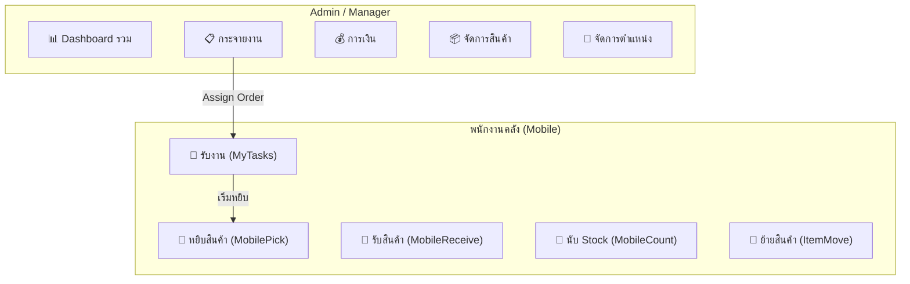

---

## 🗄️ Database Schema (ตารางหลัก)

| Table | คำอธิบาย | Records |
|-------|----------|---------|
| `products` | สินค้าทั้งหมด | ~428 |
| `inventory_items` | สินค้าในคลัง (ระบุตำแหน่ง, จำนวน, lot) | ~1,198 |
| `inventory_movements` | ประวัติเคลื่อนย้ายสินค้า | ~270 |
| `warehouse_locations` | ตำแหน่งในคลัง (A1/1 - Z99/9) | ~1,111 |
| `customer_orders` | ออเดอร์ลูกค้า | ~7 |
| `order_items` | รายการสินค้าในออเดอร์ | ~7 |
| `shipment_orders` | สถานะจัดส่ง (sync จาก JHCSMILE) | dynamic |
| `purchase_orders` | ใบสั่งซื้อ (sync จาก JLC API) | dynamic |
| `users` | ผู้ใช้งาน | ~10 |
| `unit_conversions` | อัตราแปลงหน่วย | dynamic |

---

## 🌐 Network & Deployment

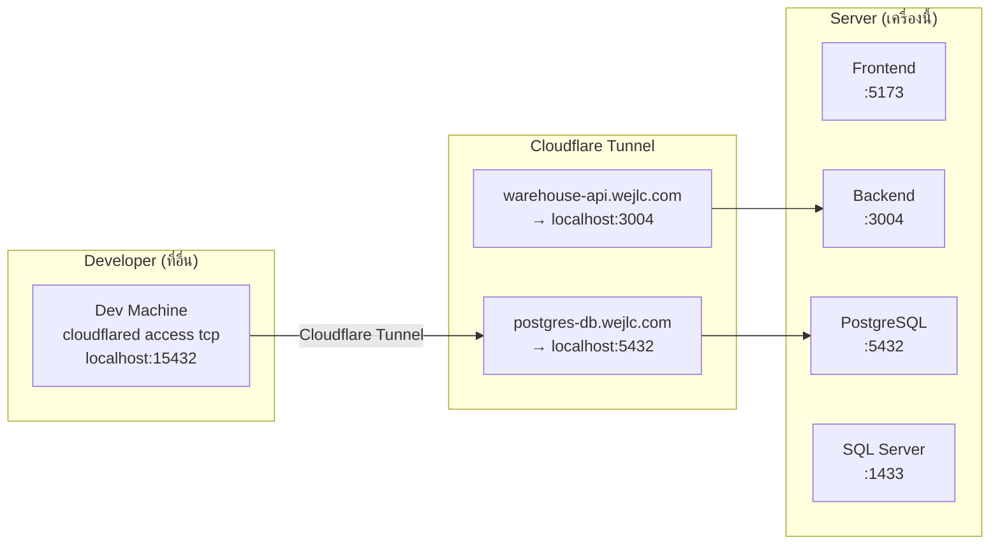

---

## ⚡ สถานะปัจจุบัน

| ส่วน | สถานะ | หมายเหตุ |
|------|--------|---------|
| 📥 รับสินค้า (Inbound) | ✅ ใช้งานได้ | ผ่าน Local DB |
| 📍 จัดการตำแหน่ง | ✅ ใช้งานได้ | QR + Shelf Grid |
| 🛒 ออเดอร์ + Packing List | ✅ ใช้งานได้ | Sync จาก JHCSMILE |
| 📋 กระจายงาน (Assign) | ✅ ใช้งานได้ | TaskAssignment → MyTasks |
| 📱 หยิบสินค้า (Pick) | ✅ ใช้งานได้ | FEFO Algorithm |
| 📦 แพค (Pack) | ⚠️ เพิ่ง migrate | Local DB proxy พร้อมแล้ว |
| 🚚 จัดส่ง (Ship) | ✅ ใช้งานได้ | Mark as shipped |
| 💰 การเงิน | ✅ ใช้งานได้ | CSMILE Integration |
| 🔄 Auto Sync | ✅ ทำงาน | ทุก 6 ชม. |
| 🌐 External Access | ✅ ตั้งค่าแล้ว | Cloudflare Tunnel |
| 🗄️ Local DB Proxy | ✅ สมบูรณ์ | เพิ่ม 7 methods แล้ว |
