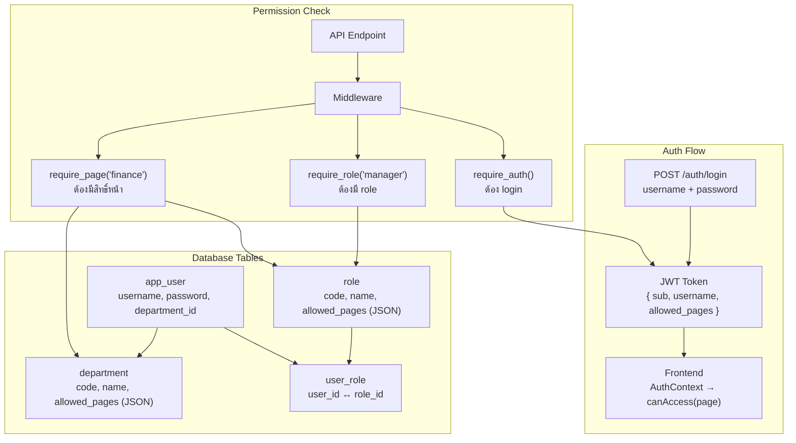

# WeOrder → We-Warehouse: ระบบ Role/Department/Permission

> **วัตถุประสงค์:** วิเคราะห์ Logic การแบ่งสิทธิ์จาก WeOrder เพื่อนำมาพัฒนาต่อใน We-Warehouse

---

## 📊 เปรียบเทียบระบบทั้งสอง

| Feature | WeOrder ✅ | We-Warehouse (ปัจจุบัน) |
|---------|-----------|------------------------|
| **Auth** | JWT + bcrypt + SSO | localStorage + query users table |
| **Role storage** | DB table `role` | Hardcoded ใน `permissions.ts` |
| **Department** | DB table `department` | String field ใน `users` table |
| **User-Role** | Many-to-Many (`user_role` table) | 1 role per user (`role_level` field) |
| **Page Access** | `allowed_pages[]` จาก Role + Dept | `role_level` → `ROLE_PERMISSIONS[]` |
| **Backend Guard** | `require_role()`, `require_page()` | ไม่มี (API เปิดทั้งหมด) |
| **Frontend Guard** | `canAccess(page)` | `hasPermission()`, `hasRole()`, `hasMinimumRole()` |
| **Admin UI** | CRUD Users/Roles/Departments | ไม่มี |

---

## 🏗️ สถาปัตยกรรม WeOrder (ต้นแบบ)



### หลักการสำคัญ:
1. **Role** กำหนด `allowed_pages[]` → เช่น manager เข้าได้: `["dashboard", "orders", "finance"]`
2. **Department** กำหนด `allowed_pages[]` เพิ่มเติม → เช่น แผนกบัญชี เข้าได้: `["finance", "invoice"]`
3. **User** ได้ **union** ของ pages จาก Role + Department
4. **Super Admin** bypass ทุก check

---

## 🔍 ไฟล์ WeOrder ที่สำคัญ

### Backend (Python/FastAPI):

| ไฟล์ | หน้าที่ |
|------|---------|
| [master.py](file:///d:/AI_WORKSPACE/AI_Project/Github/weorder/app/models/master.py) | Models: `Department`, `Role`, `AppUser`, `UserRole` |
| [auth.py](file:///d:/AI_WORKSPACE/AI_Project/Github/weorder/app/api/auth.py) | Login, JWT, SSO, `get_user_allowed_pages()` |
| [permissions.py](file:///d:/AI_WORKSPACE/AI_Project/Github/weorder/app/api/permissions.py) | Middleware: `require_auth`, `require_role`, `require_page` |
| [users.py](file:///d:/AI_WORKSPACE/AI_Project/Github/weorder/app/api/users.py) | CRUD APIs + seed roles + `AVAILABLE_PAGES` |

### Frontend (React/TypeScript):

| ไฟล์ | หน้าที่ |
|------|---------|
| [AuthContext.tsx](file:///d:/AI_WORKSPACE/AI_Project/Github/weorder/frontend/src/contexts/AuthContext.tsx) | `useAuth()` hook → `canAccess(page)` |

---

## 🏭 We-Warehouse (ปัจจุบัน)

### มีอยู่แล้ว:

| ไฟล์ | หน้าที่ | สถานะ |
|------|---------|--------|
| [AuthContextSimple.tsx](file:///d:/AI_WORKSPACE/AI_Project/Github/we-warehouse/src/contexts/AuthContextSimple.tsx) | Auth context: `hasPermission`, `hasRole`, `hasMinimumRole`, `isInDepartment` | ✅ ใช้งานอยู่ |
| [AuthGuard.tsx](file:///d:/AI_WORKSPACE/AI_Project/Github/we-warehouse/src/components/auth/AuthGuard.tsx) | Guard: `requiredPermission`, `requiredRole`, `requiredDepartment` | ✅ ใช้งานอยู่ |
| [PermissionGate.tsx](file:///d:/AI_WORKSPACE/AI_Project/Github/we-warehouse/src/components/PermissionGate.tsx) | `FinanceGate`, `AdminGate`, `SalesGate` etc. | ✅ ใช้งานอยู่ |
| [permissions.ts](file:///d:/AI_WORKSPACE/AI_Project/Github/we-warehouse/src/config/permissions.ts) | Hardcoded `ROLE_PERMISSIONS` (level 1-5) | ⚠️ ต้อง migrate ไป DB |

### ระบบ Role ปัจจุบัน (Hardcoded):
```
Level 5: ผู้ดูแลระบบ     → ทุกสิทธิ์
Level 4: ผู้จัดการคลัง    → คลัง + การเงิน
Level 3: หัวหน้าแผนก     → คลัง + ขาย (การเงินจำกัด)
Level 2: เจ้าหน้าที่      → คลังพื้นฐาน (ไม่มีการเงิน)
Level 1: ผู้อ่านอย่างเดียว → ดูอย่างเดียว
```

### สิ่งที่ขาด:
1. ❌ **DB-driven Roles** — ตอนนี้ hardcode ใน `permissions.ts`
2. ❌ **Department Table** — ตอนนี้เป็น string field ใน users
3. ❌ **User-Role Many-to-Many** — ตอนนี้ 1 user = 1 role_level
4. ❌ **Page-based Access** — ตอนนี้ใช้ permission ID (`inventory.view`, `finance.accounting`)
5. ❌ **Backend Auth Middleware** — API ไม่มี guard เลย
6. ❌ **JWT Token** — ตอนนี้ใช้ localStorage เก็บ user object
7. ❌ **Admin UI สำหรับจัดการ Roles/Departments** — ไม่มี

---

## 🗺️ แผนพัฒนาที่แนะนำ

### Phase 1: DB Tables + Backend Auth (สำคัญที่สุด)

สร้าง tables ใน PostgreSQL เพื่อเก็บ roles/departments แบบ dynamic:

```sql
-- ตาราง Department (แผนก)
CREATE TABLE departments (
    id UUID PRIMARY KEY DEFAULT gen_random_uuid(),
    code VARCHAR(50) UNIQUE NOT NULL,      -- 'warehouse', 'finance', 'sales'
    name VARCHAR(100) NOT NULL,            -- 'แผนกคลัง', 'แผนกบัญชี'
    allowed_pages TEXT,                     -- JSON: ["dashboard","picking","inventory"]
    created_at TIMESTAMPTZ DEFAULT NOW()
);

-- ตาราง Role (บทบาท)
CREATE TABLE roles (
    id UUID PRIMARY KEY DEFAULT gen_random_uuid(),
    code VARCHAR(50) UNIQUE NOT NULL,      -- 'admin', 'manager', 'picker', 'viewer'
    name VARCHAR(100) NOT NULL,            -- 'ผู้ดูแลระบบ', 'ผู้จัดการ'
    allowed_pages TEXT,                     -- JSON: ["dashboard","finance","admin"]
    created_at TIMESTAMPTZ DEFAULT NOW()
);

-- ตาราง User-Role (Many-to-Many)
CREATE TABLE user_roles (
    user_id UUID REFERENCES users(id) ON DELETE CASCADE,
    role_id UUID REFERENCES roles(id) ON DELETE CASCADE,
    PRIMARY KEY (user_id, role_id)
);

-- เพิ่ม department_id ใน users table
ALTER TABLE users ADD COLUMN department_id UUID REFERENCES departments(id);
```

### Phase 2: JWT Auth + Backend Middleware

เพิ่ม JWT login และ middleware guard ใน Express backend:

```typescript
// ตัวอย่าง middleware (Express)
function requireRole(...roleCodes: string[]) {
    return async (req, res, next) => {
        const user = req.user; // จาก JWT
        if (user.roles.some(r => roleCodes.includes(r.code))) {
            next();
        } else {
            res.status(403).json({ error: 'Forbidden' });
        }
    };
}
```

### Phase 3: Frontend `canAccess(page)` + Admin UI

- เปลี่ยน `AuthContextSimple` ให้เก็บ `allowed_pages[]` จาก JWT token
- เพิ่ม `canAccess(page)` function เหมือน WeOrder
- สร้างหน้า Admin สำหรับจัดการ Roles/Departments

### Available Pages สำหรับ We-Warehouse:

```typescript
const AVAILABLE_PAGES = [
    { key: "dashboard",    name: "Dashboard" },
    { key: "inventory",    name: "สินค้าในคลัง" },
    { key: "locations",    name: "จัดการตำแหน่ง" },
    { key: "orders",       name: "ออเดอร์" },
    { key: "picking",      name: "หยิบสินค้า" },
    { key: "packing",      name: "แพคสินค้า" },
    { key: "shipping",     name: "จัดส่ง" },
    { key: "assignment",   name: "กระจายงาน" },
    { key: "finance",      name: "การเงิน" },
    { key: "accounting",   name: "บัญชี" },
    { key: "products",     name: "จัดการสินค้า" },
    { key: "transfers",    name: "โอนย้ายสินค้า" },
    { key: "reports",      name: "รายงาน" },
    { key: "admin",        name: "จัดการระบบ" },
];
```

---

## 🔑 สรุป: สิ่งที่ต้องทำ

| ลำดับ | งาน | ความเร่งด่วน |
|-------|------|-------------|
| 1 | สร้าง tables: `departments`, `roles`, `user_roles` | 🔴 สูง |
| 2 | เพิ่ม JWT login + middleware ใน backend | 🔴 สูง |
| 3 | ย้าย permissions จาก hardcode → DB | 🟡 กลาง |
| 4 | เพิ่ม `canAccess(page)` ใน frontend | 🟡 กลาง |
| 5 | สร้าง Admin UI จัดการ Roles/Departments | 🟢 ต่ำ |
| 6 | Seed default roles (admin, manager, picker, viewer) | 🟡 กลาง |
